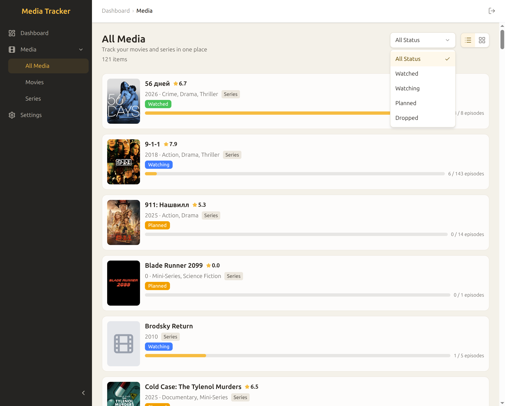
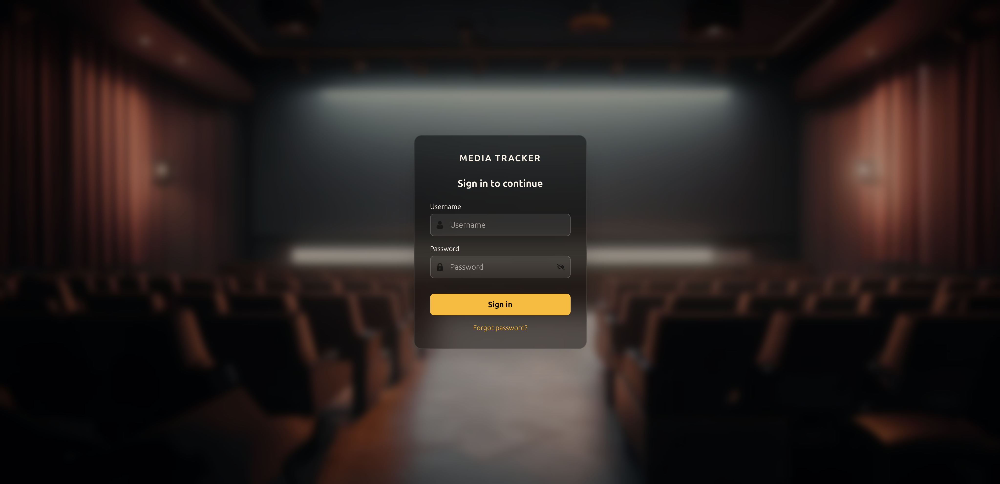

# Media Tracker


[](https://github.com/randomnanastya/media-tracker/releases)
[](https://github.com/randomnanastya/media-tracker/actions/workflows/backend-ci.yaml)

A self-hosted dashboard that aggregates statistics from your media stack — **Sonarr**, **Radarr**, and **Jellyfin** — into a single interface. Track watch history, library growth, and per-user activity without any third-party cloud service.

## Screenshots





## Features

- Imports movies from Radarr and series from Sonarr, enriched with Jellyfin watch data
- Per-user watch history with episode-level granularity
- Scheduled nightly sync (configurable, runs at 1–2 AM UTC by default)
- Manual sync triggers via REST API
- JWT authentication with refresh tokens and recovery codes (no email required)
- Fully self-hosted — data never leaves your server

## Prerequisites

- Docker and Docker Compose
- A running instance of at least one of: Jellyfin, Radarr, Sonarr
- API keys for the services you want to connect

## Quick Start

**1. Create a working directory and add the two files below**

`docker-compose.yaml`

```yaml
services:
  backend:
    image: ghcr.io/randomnanastya/media-tracker:latest
    container_name: media-backend
    env_file:
      - "./.env"
    ports:
      - '${APP_PORT}:8000'
    volumes:
      - "./logs:/app/logs"
    depends_on:
      db:
        condition: service_healthy
    restart: always

  frontend:
    image: ghcr.io/randomnanastya/media-tracker-frontend:latest
    container_name: media-frontend
    ports:
      - "80:80"
    environment:
      - BACKEND_URL=http://backend:8000
    depends_on:
      - backend
    restart: always

  db:
    image: postgres:15
    container_name: media-db
    restart: always
    env_file:
      - "./.env"
    volumes:
      - "db_data:/var/lib/postgresql/data"

volumes:
  db_data:
```

`.env`

```dotenv
# App
APP_ENV=development        # use "production" only when served over HTTPS
APP_PORT=8000

# Database
POSTGRES_USER=media
POSTGRES_PASSWORD=changeme
POSTGRES_DB=media_tracker
POSTGRES_HOST=db
POSTGRES_PORT=5432
RUN_MIGRATIONS=true

# Auth — generate with: python3 -c "import secrets; print(secrets.token_hex(32))"
JWT_SECRET=<your-random-256-bit-hex>
JWT_ALGORITHM=HS256
ACCESS_TOKEN_EXPIRE_MINUTES=15
REFRESH_TOKEN_EXPIRE_DAYS=30
```

**2. Start the stack**

```bash
docker compose up -d
```

The UI is available at `http://<your-host>`. On first visit you will be prompted to create an admin account. **Save the recovery code** shown after registration — it is the only way to reset your password without CLI access.

## Configuration

All configuration is done through environment variables in `.env`.

| Variable | Required | Description |
|---|---|---|
| `APP_ENV` | yes | `production` (HTTPS) or `development` (HTTP) |
| `APP_PORT` | yes | Port exposed on the host (e.g. `8000`) |
| `POSTGRES_USER` | yes | PostgreSQL username |
| `POSTGRES_PASSWORD` | yes | PostgreSQL password |
| `POSTGRES_DB` | yes | PostgreSQL database name |
| `POSTGRES_HOST` | yes | PostgreSQL host (use `db` with the provided compose file) |
| `JWT_SECRET` | yes | Random 256-bit hex string |
| `JWT_ALGORITHM` | yes | `HS256` |
| `ACCESS_TOKEN_EXPIRE_MINUTES` | yes | Access token lifetime (recommended: `15`) |
| `REFRESH_TOKEN_EXPIRE_DAYS` | yes | Refresh token lifetime (recommended: `30`) |
| `RUN_MIGRATIONS` | yes | Set to `true` to apply DB migrations on startup |
| `ENCRYPTION_KEY` | no | Fernet key for encrypting stored API keys. Generate with: `python3 -c "from cryptography.fernet import Fernet; print(Fernet.generate_key().decode())"` |
| `CORS_ORIGINS` | no | Comma-separated list of allowed origins (e.g. `http://localhost:5173`) |

> **`APP_ENV` and cookie security**
>
> Set `APP_ENV=production` only when the app is served over HTTPS. This flag enables the `Secure` attribute on auth cookies — browsers will refuse to send them over plain HTTP, causing silent login failures.
>
> | Access method | `APP_ENV` |
> |---|---|
> | HTTPS (recommended for public exposure) | `production` |
> | HTTP (local / internal network) | `development` |

## Updating

```bash
docker compose pull
docker compose up -d
```

Migrations run automatically on startup when `RUN_MIGRATIONS=true`.

## Password Recovery

If you lose your password, open the login page and click **"Forgot password?"**. Enter the recovery code you saved at registration and set a new password. A fresh recovery code is shown after the reset — save it again.

If you have lost both the password and the recovery code, reset via CLI:

```bash
docker exec media-backend python -m app.cli reset-password --new-password newpass123
```

<details>
<summary>Reset via API (advanced)</summary>

```
POST /api/v1/auth/reset-password
{ "recovery_code": "XXXXX-XXXXX-XXXXX-XXXXX", "new_password": "newpass" }
```
</details>

## API Reference

The backend exposes a REST API with interactive Swagger UI at `http://<your-host>:<APP_PORT>/docs`. See [`backend/README.md`](backend/README.md) for details.

## Releases

See [GitHub Releases](https://github.com/randomnanastya/media-tracker/releases) for the full changelog and versioned Docker image tags.

## Contributing

Bug reports and pull requests are welcome. Please open an issue first to discuss significant changes.

## License

MIT
